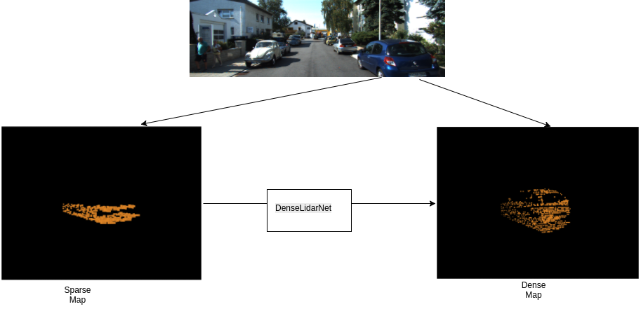

# DenseLidarNet

# Project Title
Generating Dense Lidar Data using cues from monocular image and sparse lidar data.

## Kitti Data Visualization

## Sparse to Dense Halluncination

Please find the descriptions of the files in the code folder as follows:-

1) ./code/train.py => Main file used to push the trigger for training. Supports flag for train/eval and cuda enable/disable.
2) ./code/vfe_layer.py => VFE Layer and DenseLidarNet Model in Pytorch
3) ./code/voxelize.py => Creates a voxel map for sparse lidar map and generates masks and indices.
4) ./code/dataloader.py => Pytorch DataLoader customized for DenseLidarNet.
5) ./code/chamfer_loss.py => Chamfer Loss Computation in Pytorch
