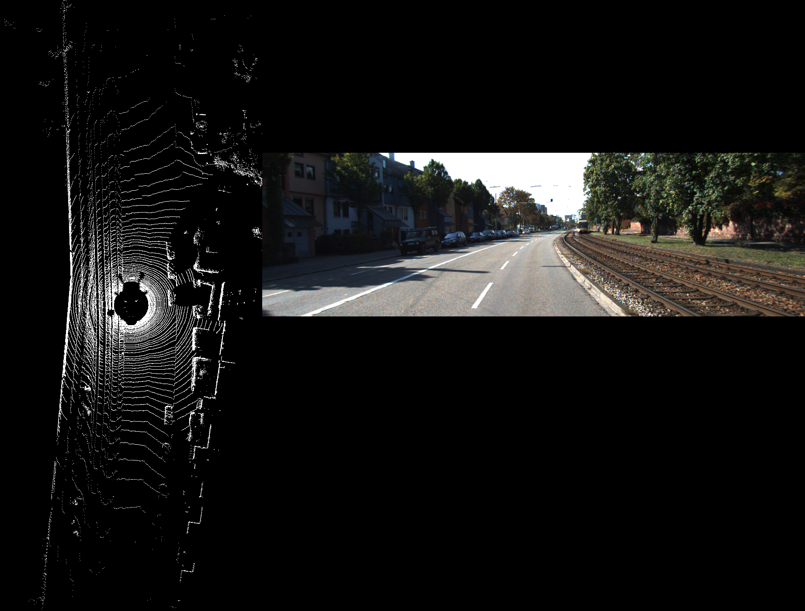

# DenseLidarNet

# Project Title
Generating Dense Lidar Data using cues from monocular image and sparse lidar data.

## Kitti Data Visualization

1) use the vfe layers of each voxel , put MLPs ahead of it and simply predict the nx3 matrix for each voxel, where n is the max cap set on each voxel.

2) To do:-
  1) Only examine points whcih have z in the range of --1.5
  2) Also, analyze what cap should we set on each voxel.
